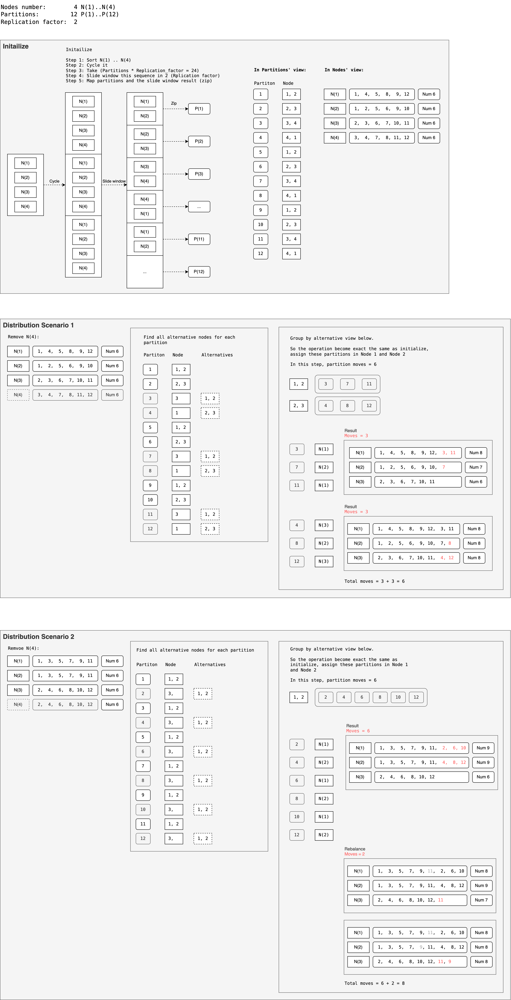

## Partition/Fragment assignment tool

Usage:

```
> assignment -h
An assignment tool for partitioning and replicating data across nodes.

Usage: assignment <COMMAND>

Commands:
  init      Initialize the assignment
  add       Add a node to the assignment, and reassign partitions
  remove    Remove a node from the assignment, and reassign partitions
  validate  Validate the assignment
  help      Print this message or the help of the given subcommand(s)

Options:
  -h, --help     Print help
  -V, --version  Print version


> assignment init -h
Initialize the assignment

Usage: assignment init [OPTIONS]

Options:
  -p, --partitions <PARTITIONS>
          The number of partitions [default: 60]
  -r, --replication-factor <REPLICATION_FACTOR>
          The replication factor [default: 3]
  -n, --nodes <NODES>
          The nodes to assign these partitions to, in comma-separated format
  -o, --output-format <OUTPUT_FORMAT>
          The output format [default: text] [possible values: json, text]
  -h, --help
          Print help
  -V, --version
          Print version


> assignment remove -h
Remove a node from the assignment, and reassign partitions

Usage: assignment remove [OPTIONS] --node <NODE> --replication-factor <REPLICATION_FACTOR>

Options:
  -n, --node <NODE>
          Node to remove
  -r, --replication-factor <REPLICATION_FACTOR>
          The replication factor
  -i, --input <INPUT>
          The existing assignment file [default: -]
  -w, --with-actions
          Whether to print the actions
  -o, --output-format <OUTPUT_FORMAT>
          The output format [default: text] [possible values: json, text]
  -h, --help
          Print help
  -V, --version
          Print version


> assignment add -h
Add a node to the assignment, and reassign partitions

Usage: assignment add [OPTIONS] --node <NODE> <INPUT>

Arguments:
  <INPUT>  The existing assignment file

Options:
  -n, --node <NODE>                    Node to add
  -w, --with-actions                   Whether to print the actions
  -o, --output-format <OUTPUT_FORMAT>  The output format [default: text] [possible values: json, text]
  -h, --help                           Print help
  -V, --version                        Print version


> assignment validate -h
Validate the assignment

Usage: assignment validate [OPTIONS] --partitions <PARTITIONS> --replication-factor <REPLICATION_FACTOR>

Options:
  -p, --partitions <PARTITIONS>                  The number of partitions
  -r, --replication-factor <REPLICATION_FACTOR>  The replication factor
  -i, --input <INPUT>                            The existing assignment file [default: -]
  -h, --help                                     Print help
  -V, --version                                  Print version
```

For example:

```bash
> assignment init -p 30 -r 3 -n node_1,node_2,node_3,node_4,node_5
Partition       Nodes
----------      ---------
        1       node_1, node_2, node_3
        2       node_2, node_3, node_4
        3       node_3, node_4, node_5
        4       node_4, node_5, node_1
        5       node_5, node_1, node_2
        6       node_1, node_2, node_3
        7       node_2, node_3, node_4
        8       node_3, node_4, node_5
        9       node_4, node_5, node_1
       10       node_5, node_1, node_2
       11       node_1, node_2, node_3
       12       node_2, node_3, node_4
       13       node_3, node_4, node_5
       14       node_4, node_5, node_1
       15       node_5, node_1, node_2
       16       node_1, node_2, node_3
       17       node_2, node_3, node_4
       18       node_3, node_4, node_5
       19       node_4, node_5, node_1
       20       node_5, node_1, node_2
       21       node_1, node_2, node_3
       22       node_2, node_3, node_4
       23       node_3, node_4, node_5
       24       node_4, node_5, node_1
       25       node_5, node_1, node_2
       26       node_1, node_2, node_3
       27       node_2, node_3, node_4
       28       node_3, node_4, node_5
       29       node_4, node_5, node_1
       30       node_5, node_1, node_2

Node     Num    Partitions
----    ----    ----------
node_1    18     1,  4,  5,  6,  9, 10, 11, 14, 15, 16, 19, 20, 21, 24, 25, 26, 29, 30
node_2    18     1,  2,  5,  6,  7, 10, 11, 12, 15, 16, 17, 20, 21, 22, 25, 26, 27, 30
node_3    18     1,  2,  3,  6,  7,  8, 11, 12, 13, 16, 17, 18, 21, 22, 23, 26, 27, 28
node_4    18     2,  3,  4,  7,  8,  9, 12, 13, 14, 17, 18, 19, 22, 23, 24, 27, 28, 29
node_5    18     3,  4,  5,  8,  9, 10, 13, 14, 15, 18, 19, 20, 23, 24, 25, 28, 29, 30
upper: 18, lower: 18, Differ: 0
```

Or you can output the result in JSON:

```bash
> assignment init -p 30 -r 3 -n node_1,node_2,node_3,node_4,node_5 -o json | jq 'to_entries.[]' -c
{"key":"1","value":["node_1","node_2","node_3"]}
{"key":"2","value":["node_2","node_3","node_4"]}
{"key":"3","value":["node_3","node_4","node_5"]}
{"key":"4","value":["node_4","node_5","node_1"]}
{"key":"5","value":["node_5","node_1","node_2"]}
{"key":"6","value":["node_1","node_2","node_3"]}
{"key":"7","value":["node_2","node_3","node_4"]}
{"key":"8","value":["node_3","node_4","node_5"]}
{"key":"9","value":["node_4","node_5","node_1"]}
{"key":"10","value":["node_5","node_1","node_2"]}
{"key":"11","value":["node_1","node_2","node_3"]}
{"key":"12","value":["node_2","node_3","node_4"]}
{"key":"13","value":["node_3","node_4","node_5"]}
{"key":"14","value":["node_4","node_5","node_1"]}
{"key":"15","value":["node_5","node_1","node_2"]}
{"key":"16","value":["node_1","node_2","node_3"]}
{"key":"17","value":["node_2","node_3","node_4"]}
{"key":"18","value":["node_3","node_4","node_5"]}
{"key":"19","value":["node_4","node_5","node_1"]}
{"key":"20","value":["node_5","node_1","node_2"]}
{"key":"21","value":["node_1","node_2","node_3"]}
{"key":"22","value":["node_2","node_3","node_4"]}
{"key":"23","value":["node_3","node_4","node_5"]}
{"key":"24","value":["node_4","node_5","node_1"]}
{"key":"25","value":["node_5","node_1","node_2"]}
{"key":"26","value":["node_1","node_2","node_3"]}
{"key":"27","value":["node_2","node_3","node_4"]}
{"key":"28","value":["node_3","node_4","node_5"]}
{"key":"29","value":["node_4","node_5","node_1"]}
{"key":"30","value":["node_5","node_1","node_2"]}

> assignment init -p 30 -r 3 -n node_1,node_2,node_3,node_4,node_5 -o json > a1.json
> cat a1.json | assignment remove -n node_4 -r 3
```

## JSON Output Format

```json
{
  "1": [ "node_1", "node_2", "node_3" ],
  "2": [ "node_2", "node_3", "node_4" ],
  "3": [ "node_3", "node_4", "node_5" ],
  "4": [ "node_4", "node_5", "node_1" ],
  "5": [ "node_5", "node_1", "node_2" ],
  "6": [ "node_1", "node_2", "node_3" ],
  "7": [ "node_2", "node_3", "node_4" ],
  "8": [ "node_3", "node_4", "node_5" ],
  "9": [ "node_4", "node_5", "node_1" ],
  "10": [ "node_5", "node_1", "node_2" ]
}
```

Convert to Erlang format:

```bash
> assignment init -p 30 -r 3 -n node_1,node_2,node_3,node_4,node_5 -o json | jq 'to_entries | map({frag_index: .key, instances: .value})'
[
  { "frag_index": "1", "instances": [ "node_1", "node_2", "node_3" ] },
  { "frag_index": "2", "instances": [ "node_2", "node_3", "node_4" ] },
  { "frag_index": "3", "instances": [ "node_3", "node_4", "node_5" ] },
  { "frag_index": "4", "instances": [ "node_4", "node_5", "node_1" ] },
  { "frag_index": "5", "instances": [ "node_5", "node_1", "node_2" ] },
  { "frag_index": "6", "instances": [ "node_1", "node_2", "node_3" ] },
  { "frag_index": "7", "instances": [ "node_2", "node_3", "node_4" ] },
  { "frag_index": "8", "instances": [ "node_3", "node_4", "node_5" ] },
  { "frag_index": "9", "instances": [ "node_4", "node_5", "node_1" ] },
  { "frag_index": "10", "instances": [ "node_5", "node_1", "node_2" ] }
]
```

Tips:

```bash
# List tables from the Erlang JSON output
cat output.json | jq '.current_snapshot.table_distribution | map(.table_name) []' -r

# Read the Erlang JSON output and read the current distribution of a table and format it for this tool:
cat output.json | jq '.current_snapshot.table_distribution | map(select(.table_name == $table)) .[0].frag_dist | map({key: .frag_index | tostring, value: .instances}) | from_entries' --arg table dropnode
cat output.json | jq '.current_snapshot.table_distribution | map(select(.table_name == $table)) .[0].frag_dist | map({key: .frag_index | tostring, value: .instances}) | from_entries' --arg table mqtt_session

# Show current assignment
cat output.json | jq '.current_snapshot.table_distribution | map(select(.table_name == $table)) .[0].frag_dist | map({key: .frag_index | tostring, value: .instances}) | from_entries' --arg table mqtt_session | assignment validate -r 2 -p 12
# Remove node 3
cat output.json | jq '.current_snapshot.table_distribution | map(select(.table_name == $table)) .[0].frag_dist | map({key: .frag_index | tostring, value: .instances}) | from_entries' --arg table mqtt_session | assignment remove -n 3 -r 2
# Add node 9
cat output.json | jq '.current_snapshot.table_distribution | map(select(.table_name == $table)) .[0].frag_dist | map({key: .frag_index | tostring, value: .instances}) | from_entries' --arg table mqtt_session | assignment add -n 9
```

## Partition/Fragment assignment strategy or algorithm.

A round-robin strategy is enough for a newly created table to balance the distribution.

For shrink, the best result of balance means the `upper bound - lower bound <= 1`.

Example:

```plain
    let replication_factor = 3;
    let partitions = 60;
    let nodes: Vec<_> = (1..=5).map(|n| Node(n)).collect();


Node     Num    Partitions
----    ----    ----------
   1      36     1,  4,  5,  6,  9, 10, 11, 14, 15, 16, 19, 20, 21, 24, 25, 26, 29, 30, 31, 34, 35, 36, 39, 40, 41, 44, 45, 46, 49, 50, 51, 54, 55, 56, 59, 60
   2      36     1,  2,  5,  6,  7, 10, 11, 12, 15, 16, 17, 20, 21, 22, 25, 26, 27, 30, 31, 32, 35, 36, 37, 40, 41, 42, 45, 46, 47, 50, 51, 52, 55, 56, 57, 60
   3      36     1,  2,  3,  6,  7,  8, 11, 12, 13, 16, 17, 18, 21, 22, 23, 26, 27, 28, 31, 32, 33, 36, 37, 38, 41, 42, 43, 46, 47, 48, 51, 52, 53, 56, 57, 58
   4      36     2,  3,  4,  7,  8,  9, 12, 13, 14, 17, 18, 19, 22, 23, 24, 27, 28, 29, 32, 33, 34, 37, 38, 39, 42, 43, 44, 47, 48, 49, 52, 53, 54, 57, 58, 59
   5      36     3,  4,  5,  8,  9, 10, 13, 14, 15, 18, 19, 20, 23, 24, 25, 28, 29, 30, 33, 34, 35, 38, 39, 40, 43, 44, 45, 48, 49, 50, 53, 54, 55, 58, 59, 60
std_dev: 0.00

After Node(2) removed:
Node     Num    Partitions
----    ----    ----------
   1      45     1,  2,  4,  5,  6,  7,  9, 10, 11, 12, 14, 15, 16, 17, 19, 20, 21, 22, 24, 25, 26, 27, 29, 30, 31, 32, 34, 35, 36, 39, 40, 41, 42, 44, 45, 46, 49, 50, 51, 52, 54, 55, 56, 59, 60
   3      45     1,  2,  3,  5,  6,  7,  8, 10, 11, 12, 13, 15, 16, 17, 18, 20, 21, 22, 23, 25, 26, 27, 28, 30, 31, 32, 33, 35, 36, 37, 38, 41, 42, 43, 45, 46, 47, 48, 51, 52, 53, 55, 56, 57, 58
   4      45     1,  2,  3,  4,  7,  8,  9, 11, 12, 13, 14, 17, 18, 19, 21, 22, 23, 24, 27, 28, 29, 31, 32, 33, 34, 37, 38, 39, 40, 41, 42, 43, 44, 47, 48, 49, 50, 51, 52, 53, 54, 57, 58, 59, 60
   5      45     3,  4,  5,  6,  8,  9, 10, 13, 14, 15, 16, 18, 19, 20, 23, 24, 25, 26, 28, 29, 30, 33, 34, 35, 36, 37, 38, 39, 40, 43, 44, 45, 46, 47, 48, 49, 50, 53, 54, 55, 56, 57, 58, 59, 60
std_dev: 0.00

After Node(4) removed:
Node     Num    Partitions
----    ----    ----------
   1      60     1,  2,  3,  4,  5,  6,  7,  8,  9, 10, 11, 12, 13, 14, 15, 16, 17, 18, 19, 20, 21, 22, 23, 24, 25, 26, 27, 28, 29, 30, 31, 32, 33, 34, 35, 36, 37, 38, 39, 40, 41, 42, 43, 44, 45, 46, 47, 48, 49, 50, 51, 52, 53, 54, 55, 56, 57, 58, 59, 60
   3      60     1,  2,  3,  4,  5,  6,  7,  8,  9, 10, 11, 12, 13, 14, 15, 16, 17, 18, 19, 20, 21, 22, 23, 24, 25, 26, 27, 28, 29, 30, 31, 32, 33, 34, 35, 36, 37, 38, 39, 40, 41, 42, 43, 44, 45, 46, 47, 48, 49, 50, 51, 52, 53, 54, 55, 56, 57, 58, 59, 60
   5      60     1,  2,  3,  4,  5,  6,  7,  8,  9, 10, 11, 12, 13, 14, 15, 16, 17, 18, 19, 20, 21, 22, 23, 24, 25, 26, 27, 28, 29, 30, 31, 32, 33, 34, 35, 36, 37, 38, 39, 40, 41, 42, 43, 44, 45, 46, 47, 48, 49, 50, 51, 52, 53, 54, 55, 56, 57, 58, 59, 60
std_dev: 0.00
```

Another example:

```plain
    let replication_factor = 3;
    let partitions = 60;
    let nodes: Vec<_> = (1..=7).map(|n| Node(n)).collect();

Node     Num    Partitions
----    ----    ----------
   1      25     1,  6,  7,  8, 13, 14, 15, 20, 21, 22, 27, 28, 29, 34, 35, 36, 41, 42, 43, 48, 49, 50, 55, 56, 57
   2      26     1,  2,  7,  8,  9, 14, 15, 16, 21, 22, 23, 28, 29, 30, 35, 36, 37, 42, 43, 44, 49, 50, 51, 56, 57, 58
   3      26     1,  2,  3,  8,  9, 10, 15, 16, 17, 22, 23, 24, 29, 30, 31, 36, 37, 38, 43, 44, 45, 50, 51, 52, 57, 58
   4      26     2,  3,  4,  9, 10, 11, 16, 17, 18, 23, 24, 25, 30, 31, 32, 37, 38, 39, 44, 45, 46, 51, 52, 53, 58, 59
   5      26     3,  4,  5, 10, 11, 12, 17, 18, 19, 24, 25, 26, 31, 32, 33, 38, 39, 40, 45, 46, 47, 52, 53, 54, 59, 60
   6      26     4,  5,  6, 11, 12, 13, 18, 19, 20, 25, 26, 27, 32, 33, 34, 39, 40, 41, 46, 47, 48, 53, 54, 55, 59, 60
   7      25     5,  6,  7, 12, 13, 14, 19, 20, 21, 26, 27, 28, 33, 34, 35, 40, 41, 42, 47, 48, 49, 54, 55, 56, 60
std_dev: 0.49

After Node(2) removed:
Node     Num    Partitions
----    ----    ----------
   1      30     1,  2,  6,  7,  8,  9, 13, 14, 15, 16, 20, 21, 22, 23, 27, 28, 29, 34, 35, 36, 41, 42, 43, 48, 49, 50, 51, 55, 56, 57
   3      30     1,  2,  3,  7,  8,  9, 10, 14, 15, 16, 17, 21, 22, 23, 24, 29, 30, 31, 36, 37, 38, 42, 43, 44, 45, 50, 51, 52, 57, 58
   4      30     2,  3,  4,  9, 10, 11, 15, 16, 17, 18, 23, 24, 25, 28, 30, 31, 32, 35, 37, 38, 39, 43, 44, 45, 46, 51, 52, 53, 58, 59
   5      30     3,  4,  5, 10, 11, 12, 17, 18, 19, 22, 24, 25, 26, 30, 31, 32, 33, 38, 39, 40, 45, 46, 47, 50, 52, 53, 54, 58, 59, 60
   6      30     4,  5,  6, 11, 12, 13, 18, 19, 20, 25, 26, 27, 29, 32, 33, 34, 37, 39, 40, 41, 46, 47, 48, 49, 53, 54, 55, 56, 57, 60
   7      30     1,  5,  6,  7,  8, 12, 13, 14, 19, 20, 21, 26, 27, 28, 33, 34, 35, 36, 40, 41, 42, 44, 47, 48, 49, 54, 55, 56, 59, 60
std_dev: 0.00

After Node(4) removed:
Node     Num    Partitions
----    ----    ----------
   1      36     1,  2,  3,  6,  7,  8,  9, 13, 14, 15, 16, 20, 21, 22, 23, 24, 27, 28, 29, 34, 35, 36, 37, 38, 39, 41, 42, 43, 48, 49, 50, 51, 55, 56, 57, 58
   3      36     1,  2,  3,  4,  7,  8,  9, 10, 11, 14, 15, 16, 17, 18, 21, 22, 23, 24, 25, 29, 30, 31, 32, 36, 37, 38, 42, 43, 44, 45, 50, 51, 52, 53, 57, 58
   5      36     2,  3,  4,  5,  9, 10, 11, 12, 15, 16, 17, 18, 19, 22, 24, 25, 26, 30, 31, 32, 33, 38, 39, 40, 44, 45, 46, 47, 50, 51, 52, 53, 54, 58, 59, 60
   6      36     4,  5,  6, 10, 11, 12, 13, 18, 19, 20, 23, 25, 26, 27, 28, 29, 30, 32, 33, 34, 35, 37, 39, 40, 41, 45, 46, 47, 48, 49, 53, 54, 55, 56, 59, 60
   7      36     1,  5,  6,  7,  8, 12, 13, 14, 17, 19, 20, 21, 26, 27, 28, 31, 33, 34, 35, 36, 40, 41, 42, 43, 44, 46, 47, 48, 49, 52, 54, 55, 56, 57, 59, 60
std_dev: 0.00

```


See also 

## References

- https://www.fluvio.io/docs/architecture/replica-assignment/
- https://github.com/apache/helix/blob/master/helix-core/src/main/java/org/apache/helix/controller/strategy/AutoRebalanceStrategy.java
- https://engineering.sift.com/open-source-kafka-partition-reassignment-minimal-data-movement/
- https://developer.confluent.io/courses/architecture/data-replication/
- https://cwiki.apache.org/confluence/plugins/servlet/mobile?contentId=50860480#content/view/50860480
